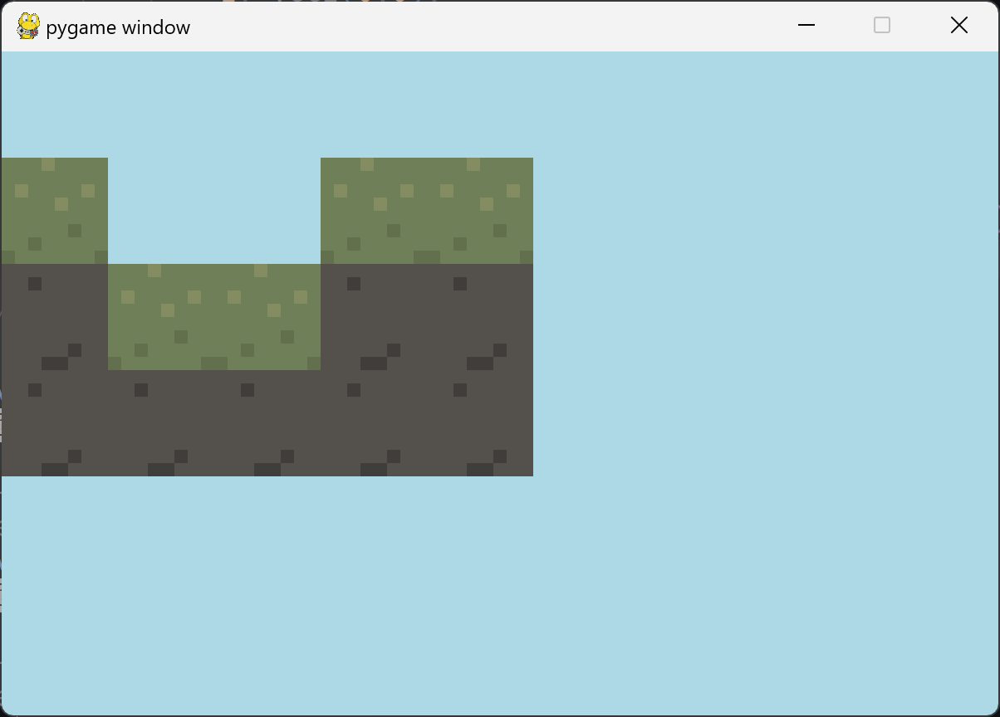

# Loading Maps from a file

This is a large section, so bare with me...

## How are Maps Displayed in Games?

Maps are typically displayed through the use of a tile map.

### What is a Tile map?

A tile map is essentially just a grid of numbers. Take this example:

```csv
1,0,0,0
1,1,0,0
2,2,1,1
2,2,2,2
```

Looks like a bunch of random numbers, right? What about a screenshot of the in-game result:



As we can see, the numbers in the `.csv` file correspond to particular tiles. In this case, `0` is air, `1` is grass, and `2` is stone.

### Why Tile Maps?

Tile maps are one of the most efficient methods to grid-based games. Instead of creating a class with unique data for each individual block, we can rely on unique identifiers (the cell values) to reduce the memory required to load in a map. Additionally, having a 2D list makes collision checks extremely fast compared to iteratively checking each tile.
## Coding Time!

### Preparation

A lot of overhead goes into writing a proper tile map renderer. To start, lets create some standards. When dealing with coordinates, we want to use int values. This means that PyGame's built-in `Vector2` class will not be sufficient, as it uses floats. Additionally, using a tuple for coordinates is less than ideal, because tuples are immutable and annoying to work with.

To make our coordinates universal and easy to use, I wrote a `Vec2` class. see [math.py](../platformer/utils/math.py) for the implementation. Basically, it's a super flexible 2D vector class that will make our lives easier in the long run.

A tile map has a lot of moving parts. Some of these parts involve a lot of additional steps. Throwing everything in one constructor could be an issue as a result. Lazy initialization violates RAII principles as well. I have decided that the best course of action for our implementation is the [builder pattern](https://refactoring.guru/design-patterns/builder).

Here's how it works:

```python
tilemap = TilemapBuilder()\
	.load_from_csv("data/map.csv")\
	.load_spritesheet("assets/spritesheet.png", 4)\
	.set_tilesize(Vec2(32, 32))\
	.set_tilekeymap(keymap)\
	.build()
```

So, what do we need to do?

- Create a `Tilemap` class
- Create a `TilemapBuilder` class
	- CSV reading
	- texture loading
	- keymapping (cell value => texture coordinate)

Here is the implementation:
```python
from dataclasses import dataclass
from ..utils.math import *
import csv
from pygame.surface import Surface
import pygame

def csv_to_2dlist(filename: str) -> list[list[int]]:
    try:
        data = []

        with open(filename, 'r') as f:
            reader = csv.reader(f)
            for row in reader:
                row = [int(cell) for cell in row]
                data.append(row)
        return data
    except ValueError:
        print(f"TILEMAP ERROR: File data is invalid, failed to parse: {filename}")
    except FileNotFoundError:
        print(f"TILEMAP ERROR: File does not exist: {filename}")
    except:
        print(f"TILEMAP ERROR: Failed to open file: {filename}")

    return [[]]

@dataclass
class Tilemap:
    tiles: list[list[int]] = None
    tilesize: Vec2 = None
    spritesheet: Surface = None
    keymap: dict[int, Vec2] = None

class TilemapBuilder:
    def __init__(self) -> None:
        self._tilemap = Tilemap()
    def load_from_csv(self, filepath: str) -> 'TilemapBuilder':
        self._tilemap.tiles = csv_to_2dlist(filepath)
        return self
    def load_spritesheet(self, filepath: str, scale: float) -> 'TilemapBuilder':
        self._tilemap.spritesheet = pygame.transform.scale_by(
            pygame.image.load(filepath).convert_alpha(),
            scale
        )
        return self
    def set_tilesize(self, tilesize: Vec2) -> 'TilemapBuilder':
        self._tilemap.tilesize = tilesize
        return self
    def set_tilekeymap(self, tilekeymap: dict[int, Vec2]) -> 'TilemapBuilder':
        self._tilemap.keymap = tilekeymap
        return self
    def build(self) -> Tilemap:
        return self._tilemap
```
___
## Using the Tile Map

Going back to our [game.py](../platformer/core/game.py) class, we need to add a `tilemap` field. We can either leave it as `None` or give it a default implementation. Given that we won't be using it until there is a valid map, I don't mind living dangerously.

We need to create a new `setup` method, to be called in `run` before the game loop. This method will handle building our tile map using the `TilemapBuilder`.

Now that we have a valid tile map, we should add it to the drawing code inside of the `draw method`. In order to draw the tiles given its integer data, we must loop over its rows and subsequent cells. We then calculate the pixel destination based on the `x` and `y` indices, multiplied by our tile size. The rect area (the portion of the spritesheet being drawn) is decided based on our key mapper, which takes the value in the cell and returns the associated coordinate.

```python
# loop over rows
        for y_index, row in enumerate(self.tilemap.tiles):
            # loop over cells in current row
            for x_index, item in enumerate(row):
                # if not air
                if item > 0:
                    # get pixel destinate x and y
                    x = x_index * self.tilemap.tilesize.x
                    y = y_index * self.tilemap.tilesize.y
                    # get texture coordinate of item
                    spritesheet_pos = Vec2(*self.tilemap.keymap.get(item, (0,0)))
                    # convert texture coordinate to rect area
                    rect_area = Rect(
                        spritesheet_pos.x * self.tilemap.tilesize.x,
                        spritesheet_pos.y * self.tilemap.tilesize.y,
                        self.tilemap.tilesize.x,
                        self.tilemap.tilesize.y
                    )

                    # draw the tile
                    self.screen.blit(
                        self.tilemap.spritesheet,
                        (x, y),
                        rect_area
                    )
```

That's it! The tile map should now display textures properly. Later on we will modify this code to account for the position of the player.
___
[< Prev](./1.md)
[Next >](./3.md)